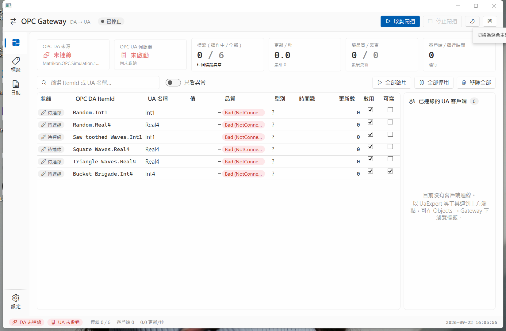
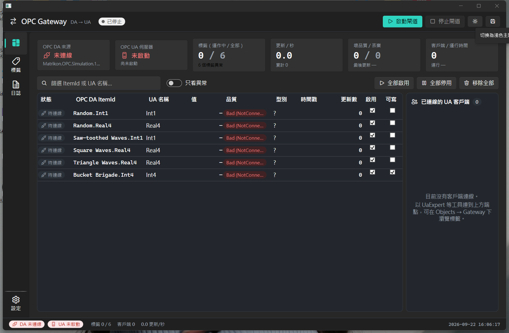

#  OPC DA to OPC UA Gateway

把傳統 OPC DA（COM/DCOM）伺服器的資料以內建的 OPC UA 伺服器對外提供，讓 UaExpert、SCADA、MES 等 OPC UA 客戶端可以讀取舊系統的標籤。以 C# / WPF 開發，介面採用 Windows 11 Fluent 風格。

| 淺色（Fluent 藍） | 深色（石墨青） |
|---|---|
|  |  |

## 功能

- **一鍵啟動閘道**：先啟動 OPC UA 伺服器（節點先以 `BadNotConnected` 出現），再連線 OPC DA 並批次訂閱標籤；任一邊失敗仍以「部分運作」狀態繼續，並持續自動重連。
- **正確的語意轉換**：DA 品質碼依 OPC UA Part 8 對應成 StatusCode（含限制位元）；DA 原生型別對應成 UA DataType（含陣列）；時間戳一律 UTC。
- **DA 斷線偵測與自動重連**：健康檢查（GetStatus）、伺服器 Shutdown 事件、COM 連線釋放事件三路偵測，斷線時所有 UA 節點標記 `BadNotConnected`，重連後自動重新訂閱。
- **鏡射 DA 階層**：UA 位址空間依 ItemId 的階層建立資料夾（`Objects/Gateway/Random/Int1`），NodeId 使用 DA ItemId 字串（`ns=2;s=Random.Int1`），不會撞名。
- **閘道狀態節點**：`Gateway/Status` 下提供 DaConnected、TagCount、UpdatesPerSecond、TotalUpdates、DroppedUpdates、LastUpdateTime、UptimeSeconds、ClientCount，供 UA 客戶端監看閘道健康。
- **可選的寫回**：每個標籤可個別允許 UA 客戶端寫入並回寫到 DA。
- **高效資料管線**：DA 回呼進入有界佇列，單一消費者 O(1) 更新 UA 節點，UI 每 250 ms 批次刷新；千級標籤不會阻塞 UI。
- **真實的客戶端資訊**：從 UA SessionManager 事件取得客戶端應用名稱、端點、安全模式、身分、訂閱數。
- **設定自動載入與儲存**：啟動時讀取 `Config/gateway_config.json`，關閉時自動寫回；支援匯入、匯出、舊版（1.x）格式自動轉換；可設定程式啟動時自動啟動閘道。
- **介面**：監控（KPI 卡片、統一的標籤即時表、客戶端清單）、標籤（樹狀延遲載入、整個伺服器搜尋、整個資料夾一次加入）、日誌（等級與關鍵字篩選、自動捲動、匯出）、設定（含欄位驗證）。
- **主題**：淺色「Fluent 藍」與深色「石墨青」兩套配色，可跟隨 Windows 或手動切換（命令列的月亮／太陽鈕，或設定頁的外觀選項），選擇會記在設定檔。

## 專案結構

```
src/OPCGateway.Core/          核心類別庫，無 UI 相依，可再包成 Windows Service
src/OPCGateway.App/           WPF 桌面程式（輸出 OPCGatewayTool.exe；Assets/ 內有執行檔與視窗用的圖示）
tests/OPCGateway.Core.Tests/  xUnit 單元測試與整合測試
tools/icon/                   圖示原始檔與算圖腳本（render.ps1，需以 powershell -STA 執行）
```

主要設計原則：

- **Core 不引用 WPF**：服務層事件在背景執行緒觸發，由 ViewModel 轉回 UI 執行緒；Core 可直接包成 Windows Service。
- **對帳而不是流程**：DA 連上／斷線、UA 啟停、標籤增刪都呼叫 `GatewayEngine.ReconcileAsync()`，由它把期望狀態收斂成實際的 DA 訂閱與 UA 節點。
- **單一消費者資料管線**：DA 回呼只把值丟進佇列，消費者以 O(1) 查表更新 UA 節點，UI 批次刷新；COM 回呼執行緒上不做阻塞。
- **DA 品質對應到 UA StatusCode**：DA 斷線為 `BadNotConnected`、停用標籤為 `BadOutOfService`、尚未收到資料為 `BadWaitingForInitialData`。
- **UA NodeId 使用 DA ItemId 字串**，資料夾依 `BranchSeparator` 鏡射 DA 階層，不做會撞名的字元替換。
- **介面色彩只用語意 token**：正常狀態不上色，只有異常才用色（ISA-101）。

## 系統需求

- Windows 10 1903 以上或 Windows 11（Mica 背景與 Snap Layouts 需 Windows 11）
- .NET Framework 4.8（Windows 10 1903 之後內建）
- **OPC Core Components Redistributable（32 位元）**：OPC DA 的 OPCEnum 與 proxy/stub 需要它，可從 OPC Foundation 網站下載
- 一個 OPC DA 伺服器；開發測試建議 Matrikon OPC Simulation Server
- 開發：.NET SDK 8 以上（用來建置 net48 專案）、Visual Studio 2022 或 VS Code

程式以 x86 編譯。這是 TitaniumAS.Opc.Client 的要求，也是多數只安裝了 32 位元 OPC Core Components 的機器所需。

## 建置與測試

```bash
dotnet build OPCGatewayTool.sln -c Release
dotnet test tests/OPCGateway.Core.Tests/OPCGateway.Core.Tests.csproj
```

整合測試需要本機 Matrikon 模擬伺服器，預設略過；設定環境變數後執行：

```bash
OPCGW_INTEGRATION=1 dotnet test tests/OPCGateway.Core.Tests/OPCGateway.Core.Tests.csproj --filter "FullyQualifiedName~IntegrationTests"
```

輸出位於 `src/OPCGateway.App/bin/Release/net48/`。要產生可直接複製到目標機器的資料夾：

```bash
dotnet publish src/OPCGateway.App/OPCGateway.App.csproj -c Release -o publish
```

目標機器只需安裝 .NET Framework 4.8 與 32 位元 OPC Core Components。執行檔與視窗圖示來自 `src/OPCGateway.App/Assets/app.ico`，要改圖示可修改 `tools/icon/render.ps1` 重新產生。

## 快速開始

1. 執行 `OPCGatewayTool.exe`。第一次啟動會在執行檔目錄建立 `Config/gateway_config.json` 與 `Logs/`。
2. 到 **設定** 頁確認 OPC DA 的 ProgID 與主機（可按「掃描」列舉本機伺服器），以及 OPC UA 的連接埠，按「套用並儲存」。
3. 到 **標籤** 頁按「連線 OPC DA」，展開樹狀圖勾選項目，或用搜尋，或對資料夾按右鍵一次加入；按「加入勾選項目」。
4. 回到主視窗按 **啟動閘道**（或 F5）。狀態列會顯示 DA 與 UA 的連線狀態與每秒更新數。
5. 用 UaExpert 連到端點（監控頁的 OPC UA 卡片可複製），在 `Objects → Gateway` 下瀏覽標籤，`Gateway/Status` 下可看閘道狀態。
6. 勾選設定頁的「程式啟動時自動啟動閘道」，之後開啟程式就會自動運作。

## 設定檔

`Config/gateway_config.json`，四個區段：

| 區段 | 內容 |
|---|---|
| `DaSource` | ProgId、Host、UpdateRateMs、PercentDeadband、ConnectTimeoutSeconds、ReconnectIntervalSeconds、HealthCheckIntervalSeconds、BranchSeparator |
| `UaServer` | ServerName、ApplicationName、ApplicationUri、Port、UseHostNameInEndpoint、AllowNoSecurity、EnableSecurity、AutoAcceptClientCertificates、MaxSessions、NamespaceUri、RootFolderName、MirrorDaHierarchy、CertificateStoreRoot |
| `Tags` | 每筆 ItemId、BrowseName（可省略，預設為 ItemId 最後一段）、Description、Enabled、AllowWrite |
| `Options` | AutoStart、UiRefreshIntervalMs、LogBufferSize、ValueQueueCapacity、BrowseChildLimit、Theme（System / Light / Dark） |

舊版（含 `OPCDAConfig`、`OPCUAConfig`、`ItemMappings` 的格式）載入時會自動轉換。

## 安全性

預設提供無安全性端點（None）與匿名登入，方便測試。生產環境建議：

- 在設定頁開啟「啟用安全端點」，並視需要關閉「保留無安全性端點」。
- 關閉「自動信任未知的客戶端憑證」，把客戶端憑證放入 `%ProgramData%\OPC Foundation\CertificateStores\UA Applications`。
- 以防火牆限制 UA 連接埠的來源。

## 版本歷史

- **2.0**：全面重寫。Core／App／Tests 分層、GatewayEngine 對帳引擎、WPF-UI Fluent 介面、深淺色主題、應用程式圖示、單元與整合測試。舊版設定檔可自動轉換。
- **1.x**：單一 WPF 專案的原型，Material Design 介面。

## 聯絡方式

如有問題或建議，請建立 GitHub Issue，或寄信至 nightmaple319@gmail.com。

## 授權

本專案使用的主要套件皆為 MIT 授權：TitaniumAS.Opc.Client、OPC Foundation UA .NET Standard（1.5.378.65 起改為 MIT）、WPF-UI、CommunityToolkit.Mvvm。OPC Core Components 依 OPC Foundation 的可轉散布授權另行安裝。
